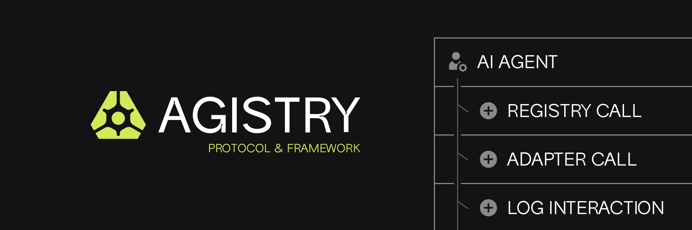
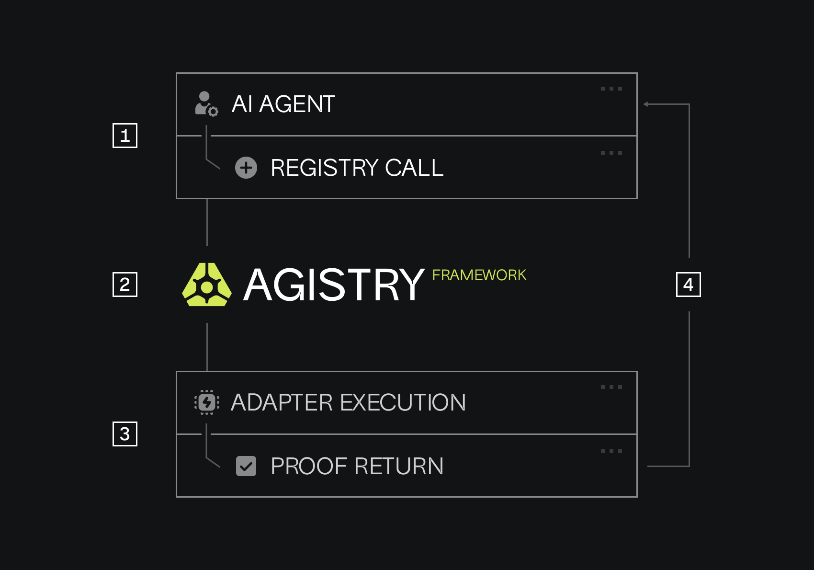

# Agistry - Type-Safe Adapter Registry SDK for AI Agents



Agistry is a type-safe TypeScript SDK that enables enterprise AI systems to seamlessly integrate with document processing, analysis, and business workflow tools through a standardized adapter interface. This SDK provides a robust, production-ready way to compose and execute complex AI workflows.

**Problem Agistry Solves:**
Enterprise AI systems often need to integrate with various document processors, analysis tools, and business systems, leading to:

- Complex integration patterns across different services
- Inconsistent error handling and logging
- Difficult context management between steps
- Limited type safety across integrations
- Complex orchestration of pre/post LLM processing

**Agistry's Solution:**

- A **type-safe adapter SDK** for enterprise integrations
- **Standardized workflow patterns** for document processing and analysis
- **Smart context propagation** across multi-step processes
- **Built-in error handling** and logging capabilities
- **Automated business actions** based on AI analysis



## Features

- **Type Safety:** 
  - Full TypeScript support with compile-time adapter validation
  - Type-safe context passing between adapters
  - Intelligent type inference for adapter chains

- **Document Processing:**
  - PDF text extraction and analysis
  - Document structure understanding
  - Content enrichment pipelines

- **Business Logic:**
  - Legal analysis workflows
  - Risk assessment automation
  - Automated notifications
  - Audit logging

- **Enterprise Ready:**
  - Comprehensive error handling
  - Detailed logging capabilities
  - Environment-based configuration
  - Secure credential management

## Installation

```bash
npm install agistry
# or
yarn add agistry
```

## Quick Start

```typescript
import { AdapterClient, AdapterExecutor } from 'agistry';
import { callLLM } from './llmService';
import { logger } from './logger';

const client = new AdapterClient({
  baseUrl: 'https://api.agistry.ai',
  headers: {
    Authorization: `Bearer ${process.env.AGISTRY_API_KEY}`
  }
});

const agistry = new AdapterExecutor(client);

export async function runContractFlow(docUrl: string, userId: string) {
  const input = 'Analyze this contract for legal risks and obligations.';
  const context = { userId, docUrl };

  try {
    // Pre-LLM adapters
    const { prompt, context: enrichedContext } = await agistry.runBeforeLLM(
      input,
      [
        'pdf-text-extractor',
        'persona-legal',
        'vector-search-legal'
      ],
      context
    );

    // LLM Call
    const llmOutput = await callLLM({
      prompt,
      system: 'You are a legal contract assistant. Return a summary and flag if risky.',
      context: enrichedContext
    });


    // Post-LLM adapters
    await agistry.runAfterLLM(enrichedContext, [
      'slack-sender',
      'db-logger'
    ]);

    return {
      analysis: llmOutput,
      context: enrichedContext
    };
  } catch (err) {
    logger.error('Contract analysis failed:', err);
    throw err;
  }
}

// Usage
const result = await runContractFlow(
  'https://example.com/contract.pdf',
  'user_123'
);
```

The example above demonstrates:
- Document processing with `pdf-text-extractor`
- Legal analysis enrichment with `persona-legal` and `vector-search-legal`
- Automated notifications with `slack-sender`
- Logging with `db-logger`

You can also run adapters in parallel:

```typescript
const results = await executor.runParallel(
  'input text',
  ['wallet-tracker', 'sql-query-tool']
);
```

## Core Concepts

- **AdapterClient:** Base client for secure adapter communication
  ```typescript
  const client = new AdapterClient({
    baseUrl: process.env.AGISTRY_API_URL,
    headers: {
      Authorization: `Bearer ${process.env.AGISTRY_API_KEY}`
    }
  });
  ```

- **AdapterExecutor:** Orchestrates complex adapter workflows
  ```typescript
  const executor = new AdapterExecutor(client);
  const { prompt, context } = await executor.runBeforeLLM(
    input,
    ['pdf-text-extractor', 'persona-legal'],
    initialContext
  );
  ```

- **Context Management:** Rich context object for workflow state
  ```typescript
  interface DocumentContext {
    docUrl: string;
    userId: string;
    meta?: {
      riskLevel?: 'low' | 'medium' | 'high';
      notifySlackIfRisky?: boolean;
    };
    output?: string;
  }
  ```

## API Reference

### AdapterClient

```typescript
class AdapterClient {
  constructor(config: AdapterConfig)
  
  async callAdapter(
    adapterId: AdapterId,
    input: string | null,
    context?: AdapterContext
  ): Promise<AdapterResponse>
}
```

### AdapterExecutor

```typescript
class AdapterExecutor {
  constructor(client: AdapterClient)
  
  async runBeforeLLM(
    input: string,
    adapterIds: AdapterId[],
    context?: AdapterContext
  ): Promise<{ prompt: string; context: AdapterContext }>
  
  async runAfterLLM(
    context: AdapterContext,
    adapterIds: AdapterId[]
  ): Promise<void>
}
```

## Common Patterns

### Document Analysis Flow

```typescript
// 1. Initialize with document
const context = { 
  docUrl: 'https://contracts.company.com/latest.pdf',
  userId: 'user_123',
  meta: { requiresApproval: true }
};

// 2. Process and analyze
const { prompt, context: enriched } = await executor.runBeforeLLM(
  'Analyze this contract',
  ['pdf-text-extractor', 'persona-legal'],
  context
);

// 3. Get LLM analysis
const llmOutput = await callLLM({ prompt, context: enriched });

// 4. Take action based on analysis
await executor.runAfterLLM(
  { ...enriched, analysis: llmOutput },
  ['slack-sender', 'db-logger']
);
```

### Error Handling

```typescript
try {
  const result = await executor.runBeforeLLM(
    input,
    ['pdf-text-extractor'],
    context
  );
} catch (error) {
  if (error.code === 'ADAPTER_ERROR') {
    logger.error('Adapter execution failed:', error);
    // Handle adapter-specific errors
  }
  throw error;
}
```

## Environment Setup

```bash
# Required environment variables
AGISTRY_API_KEY=your_api_key
AGISTRY_API_URL=https://api.agistry.ai

# Optional configuration
AGISTRY_TIMEOUT=30000
AGISTRY_LOG_LEVEL=info
```

## Future Considerations

- **Advanced Document Processing:**
  - Support for more document types
  - Enhanced metadata extraction
  - Document comparison capabilities

- **Workflow Enhancements:**
  - Conditional adapter execution
  - Parallel processing optimization
  - Workflow templating system

- **Enterprise Features:**
  - Role-based access control
  - Audit trail enhancements
  - Custom adapter development tools

---

For detailed API documentation and examples, visit our [documentation](https://docs.agistry.dev).
